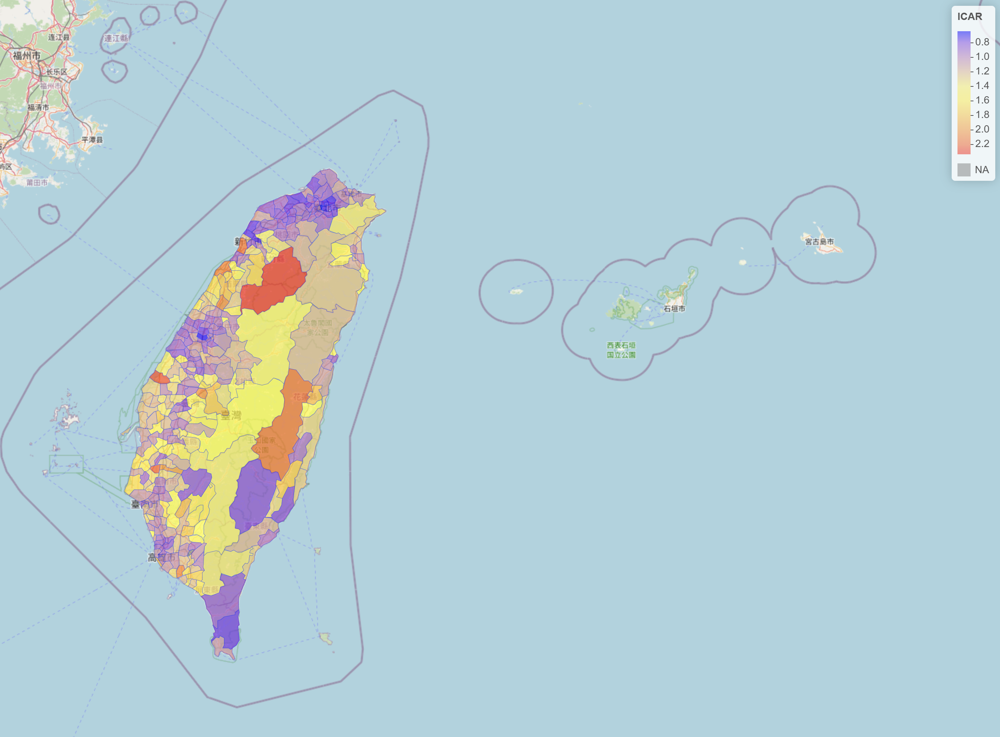

# Taiwan_Stroke
A choropleth map showing the standardised mortality ratio (SMR) for each town region, using the ICAR model adjusting for age, sex, hypertension and diabetes.

Click on the image below to see the interactive map version

